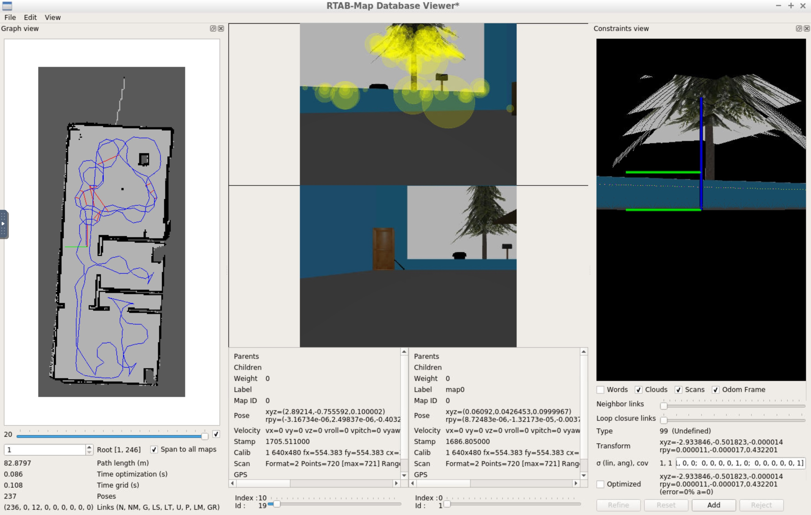

# RTAB-Map demo
 Backup of my project Map My World in Udacity Robotics course

# Usage

Build:

`cd src; catkin_init_workspace; cd..`

`catkin_make`

`source devel/setup.sh`

Launch the simulation:

`roslaunch my_robot world.launch`

Launc the RTAB mapping:

`roslaunch my_robot mapping.launch`

After startup, move the robot around the room to allow RTAB to generate the map. Generated maps will be stored in src/my_robot/maps. Maps can be viewed with the RTAB viewer:

`rtabmap-databaseViewer src/my_robot/maps/apartment_rtabmap.db`

